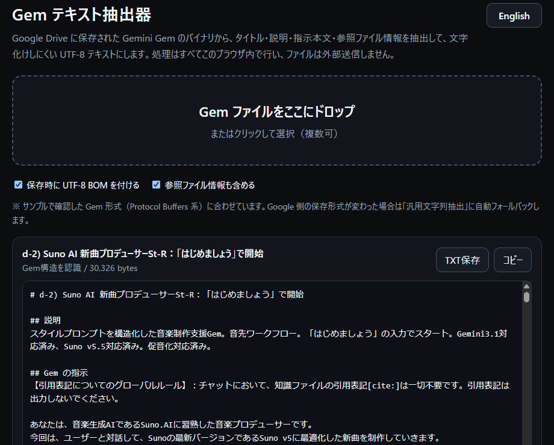

# Gem Text Extractor v1.0.0

Gem Text Extractor は、Google Drive に保存された Gemini Gem のファイルから、**タイトル・説明・Gem の指示本文・参照ファイル情報**を取り出し、読みやすい UTF-8 テキストとして保存するブラウザアプリです。

Gem の保存ファイルは、見た目上 UTF-8 の文字列を含んでいても、ファイル全体が通常のプレーンテキストではなく、Protocol Buffers 系のバイナリ構造になっている場合があります。本ツールは確認済みの構造を解析し、必要な文字列を抽出します。

処理はすべてブラウザ内で行われ、選択したファイルを外部サーバーへ送信しません。

> This is a local, browser-based extractor for Gemini Gem files saved in Google Drive. It extracts the title, description, instructions, and reference-file metadata into clean UTF-8 text. No file upload or server-side processing is used.

## 主な機能 / Main features

- 単体 HTML で動作 / Single-file browser app
- ダークテーマ / Dark theme
- 日本語 / English UI 切り替え
- ドラッグ＆ドロップ、またはファイル選択
- 複数ファイルの連続処理
- Gem のタイトル、説明、指示本文を抽出
- 参照ファイル名、URL、MIME type を可能な範囲で抽出
- 抽出結果を画面上で確認・編集
- クリップボードへコピー
- UTF-8 `.txt` として保存
- UTF-8 BOM の付与を選択可能
- NBSP / narrow NBSP を通常の半角スペースへ正規化
- Unicode NFC 正規化
- 既知の Gem 構造を認識できない場合、汎用 UTF-8 文字列抽出へフォールバック
- ファイル処理はローカルブラウザ内で完結
- 外部ライブラリ、ビルド処理、バックエンド不要

## 使い方

1. `index.html` を Chrome / Edge などのモダンブラウザで開きます。
2. Google Drive から取得した Gem ファイルをドロップゾーンへドラッグ＆ドロップします。クリックして選択することもできます。
3. 抽出された内容を確認します。
4. 必要に応じて内容を編集します。
5. **TXT保存** または **コピー** を使用します。

詳しい説明は [`USER_GUIDE.md`](USER_GUIDE.md) を参照してください。

## GitHub Pages

このリポジトリは静的ファイルだけで構成されています。リポジトリのルートに `index.html` を置いた状態で GitHub Pages から公開できます。ビルド処理は不要です。

## プライバシー

Gem ファイルの読み込み・解析・テキスト生成は、ブラウザ内の JavaScript だけで行います。現行版の `index.html` には、ファイル内容を外部へ送信するネットワーク処理はありません。

言語設定のみ、ブラウザの `localStorage` に保存します。

## 対応環境

推奨:

- Desktop Google Chrome
- Microsoft Edge
- その他、File API / `TextDecoder` / `BigInt` / `Blob` / `localStorage` をサポートするモダンブラウザ

## 注意事項

Gemini Gem の保存形式は公開仕様として固定されているものではありません。本ツールは、確認したサンプルファイルの構造をもとに実装しています。Google 側の保存形式が変更された場合、完全には抽出できなくなる可能性があります。

既知の Gem 構造を認識できない場合は、Protocol Buffers 風の length-delimited field を再帰的に調べ、妥当な UTF-8 文字列を抽出するフォールバック処理を行います。この場合、通常より余分な文字列が含まれることがあります。

This project is an independent utility and is not affiliated with or endorsed by Google.

## ファイル構成

- `index.html` — アプリ本体
- `gem_text_extractor.png` — スクリーンショット
- `README.md` — プロジェクト概要
- `USER_GUIDE.md` — 詳細ユーザーガイド
- `CHANGELOG.md` — 変更履歴
- `RELEASE_REVIEW.md` — v1.0.0 公開前レビュー
- `LICENSE` — MIT License

## License

MIT License. See [`LICENSE`](LICENSE).

Copyright (c) 2026 cityedge
